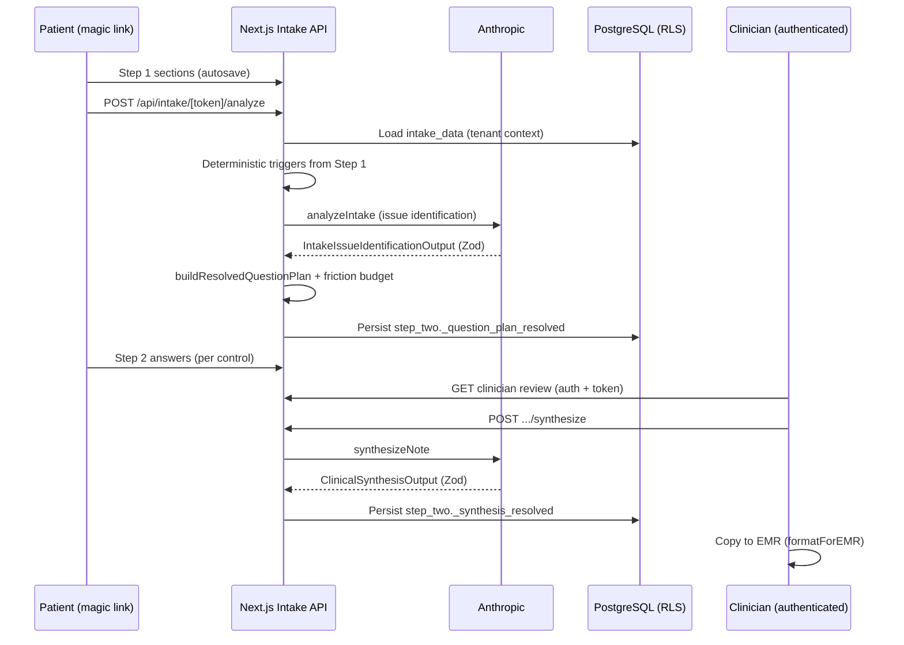

# Clinical Signal

Enterprise clinical intake and AI-assisted documentation for functional health practices. Patients complete a token-gated, multi-step intake; the platform applies deterministic routing and Anthropic-backed analysis with strict validation; clinicians review structured data, generate persisted clinical synthesis, and export EMR-ready plain text.

**Handoff context:** Product scope and practitioner workflow are documented in [`CLAUDE.md`](CLAUDE.md). Platform architecture is in [`ARCHITECTURE.md`](ARCHITECTURE.md). AWS migration status is in [`infrastructure/aws/README.md`](infrastructure/aws/README.md).

> **Deployment (2026):** Production hosting is in transition to AWS. **Local development via Docker Compose is the supported path** until cloud environments are wired.

---

## Overview

Clinical Signal implements an **agentic intake pipeline** with explicit safety boundaries: model output is treated as untrusted input, validated with Zod, capped by a friction budget, and auditable before it reaches patient or clinician surfaces.

| Phase | Capability | Primary surfaces |
|-------|------------|------------------|
| **1–3** | Magic-link intake, Step 1 (baseline sections), autosave, audit | `/intake/[token]`, `GET/POST /api/intake/[token]/*` |
| **4** | Step 1 analyze → Step 2 question plan (deterministic triggers + LLM issue ID + static banks) | `POST /api/intake/[token]/analyze`, Step 2 UI |
| **5–6** | Clinician review + clinical synthesis (CC / HPI / ROS) | `/clinician/intake/[token]`, `POST /api/clinician/intake/[token]/synthesize` |
| **7** | Persisted synthesis + EMR export | `intake_data.step_two._synthesis_resolved`, Copy to EMR |
| **8** | Demo seed patients | `pnpm run seed:demo` (in `apps/web`) |

### End-to-end workflow



1. **Step 1** — Patient completes baseline intake (demographics, MSQ, lifestyle, hormones, history, etc.) via an unauthenticated magic link. Responses are stored in `patients.intake_data` (JSONB) with provenance metadata (`_provenance`, `_ai_confirmations`, `_analysis_degraded`).
2. **Analyze** — After Step 1, `POST /api/intake/[token]/analyze` runs the unified pipeline: deterministic module keys (e.g. digestive MSQ → `gut_deep_dive`), optional **issue identification** via Anthropic, assembly of Step 2 modules from **offline question banks**, friction-budget enforcement, and persistence of `step_two._question_plan_resolved`. The HTTP handler **always returns HTTP 200 with a valid `QuestionPlanResolved`** on the happy path, including fully degraded static plans.
3. **Step 2** — Patient answers only questions in the resolved plan (typed controls: yes/no, chips, slider, free text, numeric, Bristol stool chart).
4. **Clinician review** — Authenticated practitioners open `/clinician/intake/[token]`, review Step 1 + Step 2, run **clinical synthesis**, edit in-browser, and copy a flattened note to an external EMR.

---

## Tech stack

| Layer | Technology |
|-------|------------|
| Web application | **Next.js 14** (App Router), React 18, **Tailwind CSS** (semantic tokens in `apps/web/styles/tokens.css`) |
| Data access | **Drizzle ORM** + `@cs/db` (`withTenantContext`, `withSystem`) for RLS-aware PostgreSQL access |
| Database | **PostgreSQL** with tenant **Row-Level Security**, `pgcrypto` for encrypted PHI columns |
| Validation | **Zod** — Step 1, question plan, issue identification, clinical synthesis, persisted synthesis |
| LLM | **Anthropic Messages API** (`@anthropic-ai/sdk`); PHI-free system prompts under `services/analysis-engine/prompts/` |
| Analysis service | **FastAPI** (`services/analysis-engine/`) for protocol/lab pipelines (separate from intake analyze path in `apps/web`) |
| Monorepo | **pnpm** workspaces (`apps/web`, `packages/*`, `services/*`) |
| Unit tests | **Vitest** |
| E2E | **Playwright** (`apps/web`, script `test:e2e`) |

**Runtime requirements (root `package.json`):** Node `20.11.x`, pnpm `9.12.x`.

---

## AI safety and fallback mechanisms

The intake LLM path is designed to **fail closed into deterministic, pre-approved content**—never into unvalidated JSON or unbounded question lists.

### Zod sandbox (parse retry)

`analyzeIntake` and `synthesizeNote` treat the model as an untrusted serializer:

| Step | Behavior |
|------|----------|
| Extract | Assistant text → strip markdown fences (`stripCodeFences`) → `JSON.parse` |
| Validate | Strict Zod schema: `IntakeIssueIdentificationOutput` (analyze) or `ClinicalSynthesisOutput` (synthesize) |
| Retry | **`MAX_PARSE_ATTEMPTS = 2`** — initial call plus **one retry** on parse/validation failure (`apps/web/lib/llm/analyze-intake.ts`, `synthesize-note.ts`) |
| Transport failure | Anthropic errors log structured metadata **without PHI**; function returns `null` so callers use degraded paths |

Analyze-specific schema lives in `apps/web/lib/intake/schemas/question-plan.schema.ts` (`IntakeIssueIdentificationOutput`). Synthesis schema is in `apps/web/lib/llm/clinical-synthesis.schema.ts` (requires `## Chief Complaint`, `## History of Present Illness (HPI)`, `## Review of Systems (ROS)` in `clinical_summary`).

### Friction budget (patient burden cap)

After module drafts are assembled, `applyFrictionBudget` (`apps/web/lib/intake/friction-budget.ts`) enforces caps from `FRICTION_BUDGET_DEFAULTS` (`apps/web/lib/intake/constants.ts`):

| Limit | Default |
|-------|---------|
| Max LLM-augmented modules | 4 |
| Max questions per module | 6 |
| Max total augmented questions | **18** |

**Deterministic modules** (from Step 1 triggers) are not counted toward the augmented question total. Trimming prefers `must_have` over `nice_to_have`; suppressed modules and per-module trim counts are recorded in `friction_budget_report` on the resolved plan. Hard Zod ceilings (e.g. 20 questions/module) are defined separately in `SCHEMA_LIMITS`.

### Offline fallback banks (graceful degradation)

`apps/web/lib/intake/question-banks.ts` defines **canonical, version-controlled question libraries** per `ModuleKey`, aligned with legacy dashboard deep dives (slices `question-banks-legacy-8-11.ts`, `question-banks-legacy-12-13.ts`).

When `analysis_degraded` is true, the LLM call fails, or a deterministic module has no matching LLM module payload:

- `buildResolvedQuestionPlan` / `buildDegradedQuestionPlan` (`apps/web/lib/intake/build-question-plan.ts`) loads questions via **`getFallbackQuestions(moduleKey)`**.
- Degraded envelopes set **`model_id: "static-fallback"`**.
- The analyze route’s catastrophic catch returns **`buildDegradedQuestionPlan([], …)`** so clients still receive a valid plan JSON body.

**Deterministic triggers** (`apps/web/lib/intake/deterministic-triggers.ts`) are pure functions over Step 1—no model required for gut, hormone, immune, medication, wellness, or prior-labs routing.

A separate prompt artifact, `services/analysis-engine/prompts/intake_dynamic_questions_v1.md`, documents the **approved question library** contract for future LLM-authored modules; the live analyze path uses **`intake_issue_identification_v1.md`** for issue identification only.

### Additional guardrails

- **C-PHI:** System prompts contain no patient narratives; Step 1 JSON is user message content only. Audit payloads exclude field-level PHI.
- **C-AUDIT:** Analyze, synthesize, token access, and section saves write `audit_log` via `writeAudit` (`apps/web/lib/audit/write-audit.ts`).
- **Token security:** 128-bit raw tokens, SHA-256 at rest, TTL, rate limits (`intake_tokens`, `intake_token_rate_limits`).
- **Engineering gates:** `pnpm run loc-check` (500 LOC/file), vertical **C-SLICE** layout, ESLint **C-TOKENS** (no raw colors in UI).

---

## Request lifecycle: `analyzeIntake`

**Entry:** `POST /api/intake/[token]/analyze` — `apps/web/app/api/intake/[token]/analyze/route.ts`  
**Orchestration:** `runIntakeAnalyzePipeline` — `apps/web/lib/intake/run-intake-analyze-pipeline.ts`  
**LLM client:** `analyzeIntake` — `apps/web/lib/llm/analyze-intake.ts`

| # | Stage | Detail |
|---|--------|--------|
| 1 | **Verify token** | `getIntakeTokenService().verify` — tenant/patient binding, rate limits, lockout |
| 2 | **Load state** | `getPatientIntakeState` under tenant RLS |
| 3 | **Deterministic triggers** | `extractDeterministicKeysFromIntake` → `getDeterministicTriggers(toStepOneTriggerInput(stepOne))` |
| 4 | **LLM issue identification** | Load PHI-free prompt `intake_issue_identification_v1.md`; send `intake_data` as JSON user content; validate `IntakeIssueIdentificationOutput` (up to 2 attempts). On failure → `null` → degraded path |
| 5 | **Build resolved plan** | Map LLM output to `QuestionPlanLLMOutput` (issues + optional future `question_plan` modules). **`buildSuccessQuestionPlan`** or **`buildDegradedQuestionPlan`** merges deterministic modules with **`getFallbackQuestions`** when degraded or LLM module missing; run **`applyFrictionBudget`**; produce **`QuestionPlanResolved`** |
| 6 | **Persist** | `mergeIntakeData` + `savePatientIntakeData` — `step_two._question_plan_resolved`, `_analysis_degraded`, preserve prior Step 2 answers |
| 7 | **Audit** | `intake_analysis_completed` or `intake_analysis_degraded` (PHI-free counts and flags) |
| 8 | **Respond** | JSON `QuestionPlanResolved` for Step 2 renderer (`coerceQuestionPlanResolved` for client contract) |

**Clinician synthesis (parallel path):** `synthesizeNote` (`apps/web/lib/llm/synthesize-note.ts`) → validate `ClinicalSynthesisOutput` → `savePatientSynthesisResolved` → `intake_data.step_two._synthesis_resolved` → audit `intake_synthesis_generated`. EMR export: **`formatForEMR`** (`apps/web/lib/intake/format-emr-export.ts`) flattens CC/HPI/ROS and prioritized next steps to plain text; **`CopyEmrButton`** uses `navigator.clipboard.writeText`.

---

## Repository structure

```
clinical-signal/
├── apps/web/                              # Next.js — intake, dashboard, clinician review
│   ├── app/
│   │   ├── intake/[token]/                # Patient Step 1 & Step 2
│   │   ├── clinician/intake/[token]/      # Review, synthesis, EMR copy
│   │   └── api/
│   │       ├── intake/[token]/analyze/    # Phase 4 analyze (API-3)
│   │       └── clinician/intake/          # Synthesis API
│   ├── lib/
│   │   ├── intake/                        # Triggers, banks, friction budget, merge, EMR
│   │   ├── llm/                           # analyze-intake, synthesize-note
│   │   └── tokens/                        # Intake token service
│   ├── drizzle/migrations/                # Intake DDL + RLS supplements
│   └── scripts/
│       ├── seed-demo-patients.ts          # Phase 8 demo patients
│       └── intake-drizzle-migrate.mjs
├── packages/core/                         # Tenancy, JWT types
├── packages/db/                           # Pool, RLS helpers, phiKey
├── services/analysis-engine/              # FastAPI + versioned PHI-free prompts
├── database/migrations/                   # Core platform SQL (auth, patients, protocols)
├── docker-compose.yml                     # Postgres, migrate, web, analysis-engine
└── scripts/loc-check.mjs                  # 500 LOC CI gate
```

---

## Local setup

### Prerequisites

- **Node.js** `20.11.x` and **pnpm** `9.12.x` (see root `package.json` `engines`)
- **Docker Desktop** (recommended) for PostgreSQL and one-command stack bring-up

### Environment variables

1. **Repository root** (Docker Compose and shared secrets):

   ```bash
   cp .env.example .env
   ```

   Set at minimum: `DATABASE_URL`, `PHI_ENCRYPTION_KEY` (dev seed uses `dev_only_change_me_phi_crypt_key`), `AUTH_SECRET`, `ENGINE_JWT_SECRET`, `ANTHROPIC_API_KEY` (synthetic/dev only).

2. **Web app** (intake module; required when running Next outside Compose):

   ```bash
   cp apps/web/.env.example apps/web/.env
   ```

   `apps/web/lib/env.ts` validates database, Redis, S3, Anthropic, Whisper, and intake token settings. Use example placeholders for local work.

### Database

**Option A — Docker Compose (recommended)**

```bash
docker compose up --build
```

Boot order: `postgres` → `migrate` (`database/migrations/` via `apps/web/scripts/migrate.mjs`) → `web` + `analysis-engine`. Web UI: http://localhost:3000

**Option B — Host-run platform migrations**

```bash
cd apps/web
pnpm run db:migrate
```

**Intake module schema** (intake tokens, documents, RLS helpers):

```bash
cd apps/web
pnpm run db:intake-migrate
```

Applies `apps/web/drizzle/migrations/` (brownfield: supplemental + RLS; greenfield: set `INTAKE_MIGRATE_GREENFIELD=1`). Optional follow-ups documented in migration headers, e.g.:

```bash
psql "$DATABASE_URL" -f apps/web/drizzle/migrations/0003_intake_token_rate_limits_and_verify.sql
psql "$DATABASE_URL" -f apps/web/drizzle/migrations/0004_intake_synthesis_resolved.sql
psql "$DATABASE_URL" -f apps/web/drizzle/migrations/0005_intake_token_status.sql
```

**Dev practitioner seed** (dashboard login):

```bash
psql "$DATABASE_URL" -f database/migrations/0003_seed_dev.sql
```

Login: `dev@example.com` / `devpassword12!`

### Run the web application

```bash
pnpm install
cd apps/web
pnpm run dev
```

Other `apps/web` scripts from `package.json`:

| Script | Command |
|--------|---------|
| Production build | `pnpm run build` |
| Production server | `pnpm run start` |
| Next.js lint | `pnpm run lint` |
| Typecheck | `pnpm run typecheck` |
| Drizzle Kit generate | `pnpm run db:generate` |
| Drizzle Studio | `pnpm run db:studio` |
| System-access CI gate | `pnpm run check:system-access` |

### Demo intake patients (Phase 8)

Three fictional patients (gut, hormone, metabolic) with completed Step 1 and fresh magic links:

```bash
cd apps/web
pnpm run seed:demo
```

Requires `DATABASE_URL` and `PHI_ENCRYPTION_KEY` in `apps/web/.env` (or exported in the shell). On success, prints:

- `http://localhost:3000/clinician/intake/<token>` (requires `dev@example.com` login)
- `http://localhost:3000/intake/<token>` (patient magic link)

Set `DEMO_APP_BASE_URL` to override the printed host.

---

## Testing

Install dependencies from the **repository root**:

```bash
pnpm install
```

### Root workspace (`package.json`)

| Script | What it runs |
|--------|----------------|
| `pnpm run typecheck` | `pnpm --filter @clinical-signal/web typecheck` |
| `pnpm run typecheck:intake` | `tsc -p apps/web/tsconfig.intake.json --noEmit` |
| `pnpm run verify:phase1` | `tsc -p tsconfig.db.json --noEmit` + `pnpm run loc-check` |
| `pnpm run loc-check` | `node scripts/loc-check.mjs` |
| `pnpm run lint` | ESLint on env, auth, audit, scripts |
| `pnpm run test` | `vitest run --config vitest.config.mjs` (curated intake/LLM/token tests under `apps/web/lib/`) |
| `pnpm run test:env` | `vitest run --config vitest.config.mjs lib/env.test.ts` |

The root Vitest config explicitly includes files such as `lib/llm/analyze-intake.test.ts`, `lib/llm/synthesize-note.test.ts`, `lib/intake/friction-budget.test.ts`, `lib/intake/question-banks.test.ts`, and `lib/intake/format-emr-export.test.ts`.

### `apps/web` package (`apps/web/package.json`)

```bash
cd apps/web
pnpm run test:unit      # vitest run — lib/__tests__/** and lib/**/*.test.ts
pnpm run typecheck      # tsc --noEmit
pnpm run test:e2e       # playwright test
```

**CI (`.github/workflows/validate.yml`):** `apps/web` job runs `npx tsc --noEmit` and `npx vitest run lib/__tests__/`; `engine` job runs Python `compileall` on `services/analysis-engine`.

**Analysis engine (optional local check):**

```bash
cd services/analysis-engine
pip install -r requirements-dev.txt
python -m compileall -q app scripts
```

---

## Security and compliance

- Use **synthetic data only** in local and staging environments; do not load real PHI outside production controls.
- **Business Associate Agreements** are required for production use of Anthropic and other PHI-adjacent vendors.
- **Row-Level Security** is enforced via `withTenantContext` / `withTenant` in `@cs/db` — avoid ad-hoc `pg` clients in application code (`pnpm run check:system-access` in `apps/web`).
- SQL migrations are **immutable** once applied; add a new versioned file instead of editing history.

See [`CLAUDE.md`](CLAUDE.md), [`.cursor/rules/04-c-phi.mdc`](.cursor/rules/04-c-phi.mdc), and [`.cursor/rules/05-c-audit.mdc`](.cursor/rules/05-c-audit.mdc).

---

## Related documentation

| Document | Purpose |
|----------|---------|
| [`CLAUDE.md`](CLAUDE.md) | Product workflow, MVP boundaries, build order |
| [`ARCHITECTURE.md`](ARCHITECTURE.md) | Platform architecture |
| [`docs/architecture/question-plan-schema-design.md`](docs/architecture/question-plan-schema-design.md) | Question plan contract |
| [`services/analysis-engine/prompts/`](services/analysis-engine/prompts/) | Versioned PHI-free LLM prompts |

---

## Continuous integration

GitHub Actions workflow **`validate`** (on `pull_request` and `push` to `main`) runs web typecheck, scoped Vitest unit tests, analysis-engine compile, and migration filename hygiene. Deploy workflows are pending AWS bring-up.
